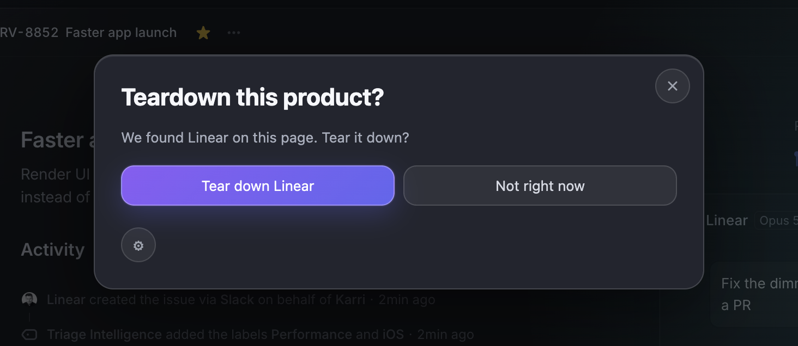
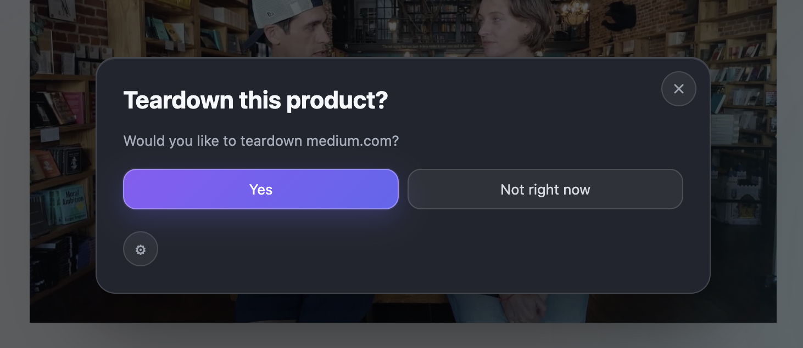
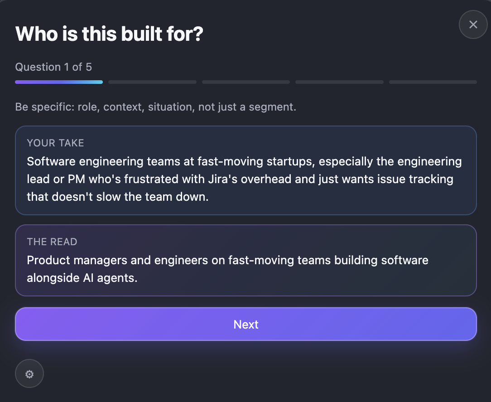
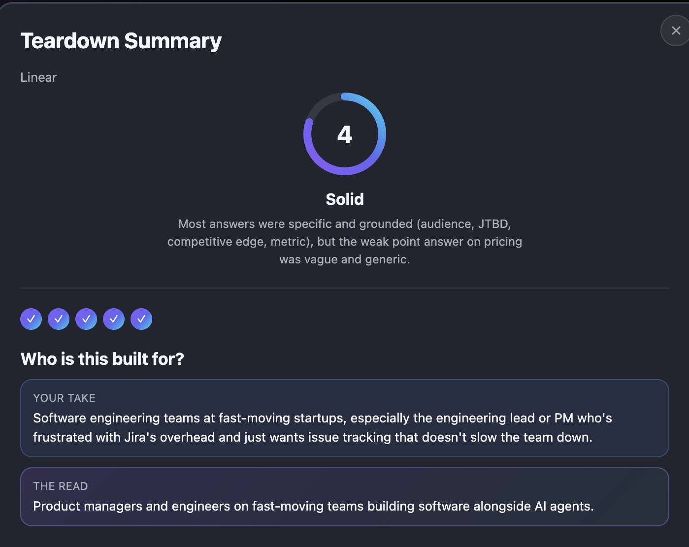

<div align="center">


# Teardown

**Practice your product sense on any product page, in one click.**

Teardown is a Chrome extension that turns any product or company page into a quick, structured practice session. It checks the page, asks five questions about it, and lets you write your own answer before revealing an AI-generated perspective on the same question.

<!-- TODO: point these at the real site and Chrome Web Store listing once they're live -->
[](#)
[](#)

</div>

## Demo


## How it works

1. Click the extension on any product or company page.



2. Teardown checks the page and confirms what it found (or offers to check the site's homepage instead if the current page isn't a clear product/company page).



3. Answer five questions, one at a time, writing your own take before revealing the AI's:
   - Who is this built for?
   - What job is this product hired to do?
   - Why does this beat the alternative?
   - What's the biggest weak point here?
   - What metric would this product move?



4. See a summary of all five answers side by side, along with a one-time score (1-5) reflecting how specific and grounded your answers were.



This is a practice tool, not a grading tool. The goal is sharper instincts, not a "correct" answer to match.

### What the score measures

The score isn't about matching the AI's phrasing, that's mimicry, not product sense. It reflects how specific and grounded your five answers were as a whole: did you name a real role, context, and situation instead of "everyone," a real alternative instead of vague fluff, a concrete gap instead of a generic complaint. One overall score, not five separate grades, with a short tier label (Vague, Broad, Developing, Solid, Sharp) and a one-line note tied to what you actually wrote.

## Bring your own key (BYOK)

Teardown requires your own Claude API key from [console.anthropic.com](https://console.anthropic.com). There is no backend server, your key is used only to make requests directly from your browser to Anthropic's API.

### How the key is actually protected

The API key input lives in a genuinely isolated `chrome-extension://` page, loaded in an iframe, cross-origin from whatever webpage you're on. This isn't just convention, it's a real browser-enforced boundary: the host webpage's own scripts cannot read or reach into that iframe, so even a malicious page you happen to be on cannot access your key.

Beyond that:
- `chrome.storage.local` is locked to trusted extension contexts only (`setAccessLevel: TRUSTED_CONTEXTS`), so even the extension's own content script cannot read the key, only the background service worker and the key-entry page can.
- The key is transmitted only in the `x-api-key` header of a direct request to `api.anthropic.com`, never in a URL, query string, or request body.
- Permissions are minimal by default (`activeTab`, `scripting`, `storage`, plus host access scoped only to `api.anthropic.com`). A separate homepage-fallback feature requests access to one specific domain only, at the moment it's needed, via a real user-facing permission prompt, never broad or persistent access.
- Every incoming message between the page-level UI and the background worker is origin-validated and allowlisted by type.

This was independently security-audited during development, including a live network trace with a canary test key to confirm it never appears anywhere except that one request header. See [SECURITY.md](./SECURITY.md) for the full breakdown.

## Installation (unpacked, local)

1. Clone this repo
2. Go to `chrome://extensions`
3. Turn on Developer Mode (top right)
4. Click "Load unpacked"
5. Select this folder

Or install directly from the [Chrome Web Store](#) once live.

## Setup

1. Click the extension icon, onboarding will walk you through getting a Claude API key
2. Or go to Settings (gear icon) any time to add or update your key

Note: Teardown won't work on Chrome's internal pages (like `chrome://extensions`) or the Chrome Web Store itself, a browser restriction affecting every extension, not a bug.

## Tech

- Manifest V3 Chrome extension
- Vanilla JS, no framework, no build step
- Claude API for page analysis, question generation, and scoring
- No backend server, no analytics, no data collection of any kind

## Project structure

```
manifest.json
background.js          — service worker: Claude API calls, message routing, permission requests
overlay.js              — content-script entry point: DOM mounting, message validation, shell
overlay-styles.js        — the overlay's CSS
teardown-flow.js         — the actual user-facing flow: onboarding, questions, summary, scoring
key-entry.html/js/css    — isolated extension-origin page for API key entry (see Security above)
permission-prompt.html/js — isolated extension-origin page for the homepage-fallback permission request
test/                    — origin-validation unit tests
```

## Disclaimers

This project is not affiliated with, endorsed by, or sponsored by Anthropic. "Claude" and the Claude API are products of Anthropic, used here under standard API terms.

All answers, scores, and analysis generated by this extension are AI-generated and may be inaccurate or incomplete. Use your own judgment.

## License

MIT, see [LICENSE](./LICENSE).
